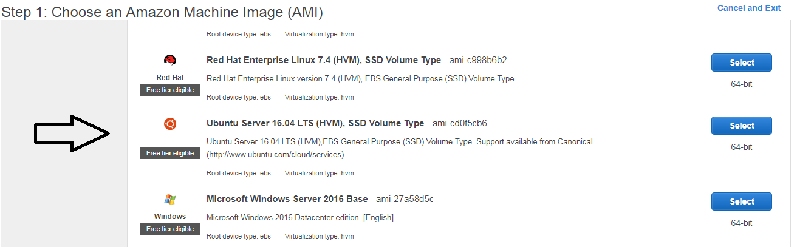
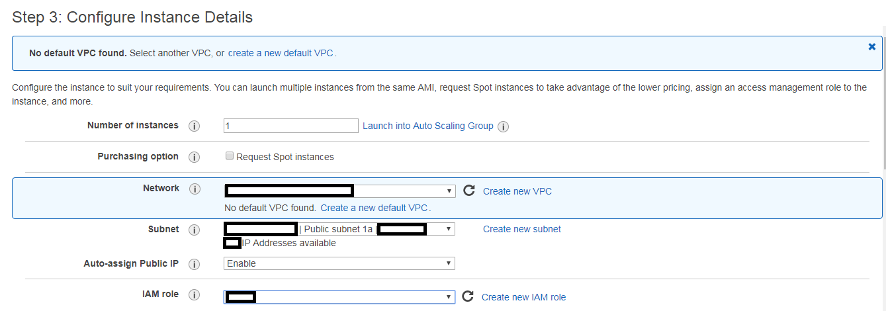

# Build Web Server and Install Classificator

### Usage
  - Run: `sh build_apache.sh`
      - Install apache
      - Install the classificator so that the apache server will point to the classificator flask application
      - Install everything in `../requirements.txt`
      - Build dependency directories and change ownership
  - The classificator homepage will now be available at `http://<public-dns>/`
  
### Setting up an Amazon EC2 instance for Hosting
  - The build script will take care of everything on a fresh instance as described above
  - In order to set up an EC2 instance to host the application and controlling permissions can be done as follows:
      - Pick a linux AMI (the version will change over time):
       

 
      - Make sure to choose a public subnet, enable public dns and add an IAM role that allows S3 access   
       

 
      - Allow traffic to an IP range (for a private network).  This example allows all traffic to all ports but you can just allow HTTP access 
       

 
  - These simple steps allow a fresh EC2 instance with the build script run to instantly host the classificator to a private network, or even just a single IP address for individual use
